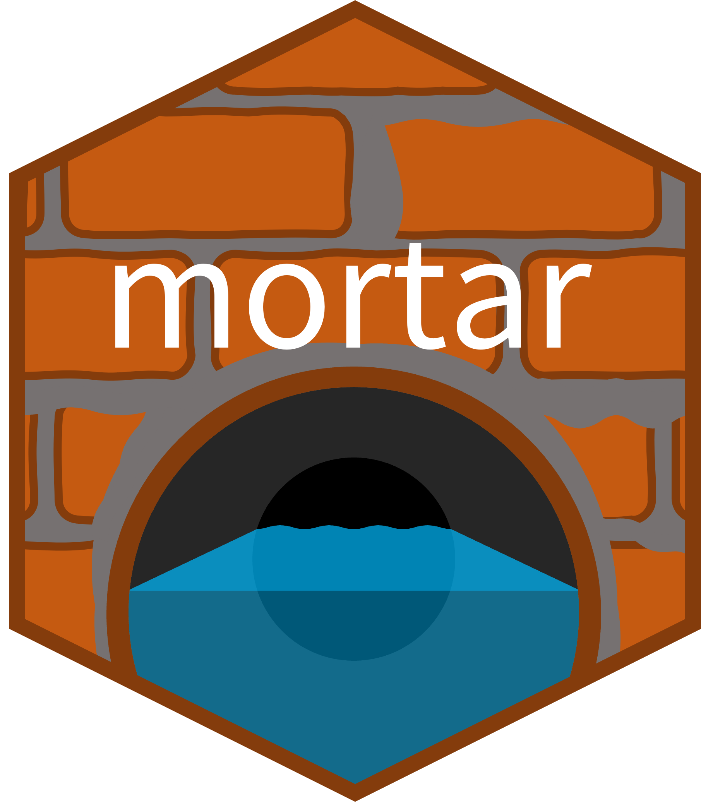

<!-- README.md is generated from README.Rmd. Please edit that file -->

```{r, include = FALSE}
knitr::opts_chunk$set(
  collapse = TRUE,
  comment = "#>",
  fig.path = "man/figures/README-",
  out.width = "100%"
)
```

# mortar 

<!-- badges: start -->

<!-- badges: end -->

<!-- > *Mortar: a plastic building material (such as a mixture of cement, -->
<!-- > lime, or gypsum plaster with sand and water) that hardens and is used -->
<!-- > in masonry or plastering* -->
<!-- > ([source](https://www.merriam-webster.com/dictionary/mortar)) -->

## Overview

> *"If you need to copy + paste the same code more than once, write a function. If you need to write the same function more than once, create a package."*
> –DRY coding principle

`mortar` was created to standardize common workflows in the USGS Water Mission Area's Data Science Branch to produce more robust, reproducible pipelines. It contains helper functions to standardize (1) the organization of project repositories and (2) the creation of [`targets`](https://books.ropensci.org/targets/) pipelines using the Data Science Practitioners Community of Practice best practices. We draw upon community developed best practices as well as certain USGS-specific requirements. We welcome feedback and suggestions from the DSP community and beyond!

#### Where did the name come from?
The package name has multiple meanings. The package mixes water (😉) with structural ingredients to form a foundation upon which our pipelines can be more easily and efficiently built. It was also initially conceptualized to provide **mor**e **tar**gets functions than those available in the `targets` and `tarchetypes` packages.

## Installation
This package is hosted on code.usgs.gov (the USGS self-hosted instance of GitLab), so you must install it from the source code from GitLab.

Until this package is publicly available, you must provide a Personal Access Token (PAT) to install this package. If you do not already have a GitLab PAT, you can follow the instructions [here](https://code.usgs.gov/water/templates/r-package#installation-instructions-when-repo-is-internal-facing).

```r
# Install the remotes package if you don't already have it
#install.packages("remotes")

remotes::install_gitlab(
  "water/computational-tools/mortar",
  host = "code.usgs.gov",
  auth_token = "Paste in your Personal Access Token (PAT) here",
  build_opts = c("--no-resave-data", "--no-manual"),
  build_vignettes = TRUE
)
```

## Usage

The main two functions in this package are `use_project_usgs()` and `tar_init()`. These build the structure of your projects and targets pipelines, removing much of the tedium of starting up a project and/or pipeline.

#### `use_project_usgs()`
Use `use_project_usgs()` to setup your project repository. It will create all the metadata files necessary for a software release, with options to customize the files. These files can then be manually edited throughout the development process to keep metadata up to date.

```{r eval=FALSE}
library(mortar)

use_project_usgs()
```

There are additional `use_*_usgs()` functions to add common project files to a directory such as a `.gitignore`, `README.md`, if you want to add them individually without setting up an entire project.

#### `tar_init()`
If you're setting up a `targets` pipeline project, you can **also** run `tar_init()` to set up the `targets` directory structure we commonly use in the DSP CoP. `tar_init()` generates the targets script file (`_targets.R`), split phase directories (optional; e.g., `01_fetch/`), and subdirectories (e.g., `02_process/src/`). 

```{r eval=FALSE}
tar_init(
  phase_names = c("fetch", "process", "visualize"),
  seperate_phase_scripts = TRUE,
  phase_subdirs = c("in", "src", "out"),
  use_leading_zeros = TRUE
)
```


Refer to the [Get started](https://water.code-pages.usgs.gov/computational-tools/mortar/articles/mortar.html) for more information using `mortar.`

## Consider contributing
Please consider reporting bugs, asking questions, or suggesting enhancements. This is a community developed package and we want it to be inclusive of the needs of our community. If considering contributing, please read [CONTRIBUTING.md]() for more information. Also, please read through [CONDUCT.md]() to ensure that we maintain a warm, welcoming, safe, and professional environment.

## Disclaimer
This software is preliminary or provisional and is subject to revision. It is being provided to meet the need for timely best science. The software has not received final approval by the U.S. Geological Survey (USGS). No warranty, expressed or implied, is made by the USGS or the U.S. Government as to the functionality of the software and related material nor shall the fact of release constitute any such warranty. The software is provided on the condition that neither the USGS nor the U.S. Government shall be held liable for any damages resulting from the authorized or unauthorized use of the software.
