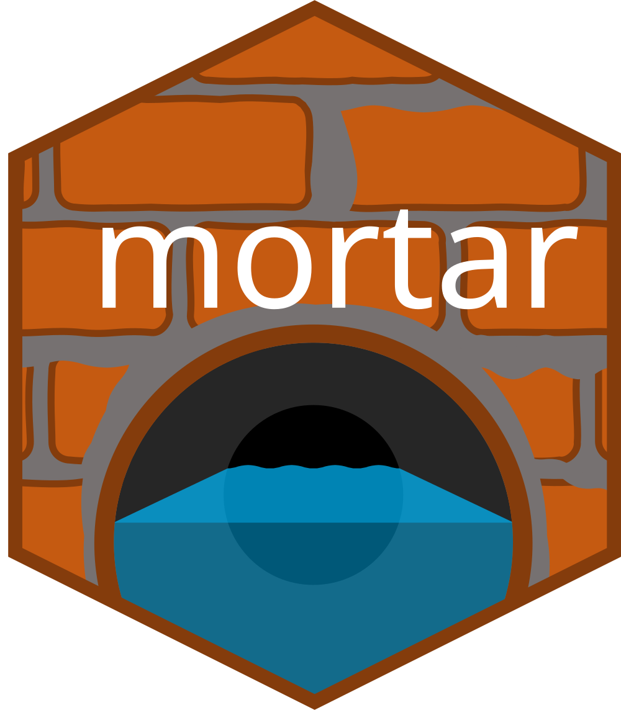

<!-- README.md is generated from README.Rmd. Please edit that file -->

```{r, include = FALSE}
knitr::opts_chunk$set(
  collapse = TRUE,
  comment = "#>",
  fig.path = "man/figures/README-",
  out.width = "100%"
)
```

# mortar 

<!-- badges: start -->

<!-- badges: end -->

## Overview

> *"If you need to copy + paste the same code more than once, write a function. If you need to write the same function more than once, create a package."*
>
> –DRY coding principle

`mortar` standardizes common workflows in the USGS Data Science Community of Practice (DS CoP) to produce more robust, reproducible pipelines. It contains helper functions to standardize (1) the organization of project repositories and (2) the creation of [`targets`](https://books.ropensci.org/targets/) pipelines using the DS CoP best practices. We draw upon community developed best practices as well as certain USGS-specific requirements.

### `use_project_usgs()`
Use `use_project_usgs()` to setup your project repository. It will create all the metadata files necessary for a software release, with options to customize the files. These files can then be manually edited throughout the development process to keep metadata up to date.

### `tar_init()`
If you're setting up a `targets` pipeline project, you can **also** run `tar_init()` to set up the `targets` directory structure we commonly use in the DS CoP. `tar_init()` generates the targets script file (`_targets.R`), split phase directories (optional; e.g., `01_fetch/`), and subdirectories (e.g., `02_process/src/`). 

Refer to the [Get started](https://doi-usgs.github.io/mortar/articles/mortar.html) page for more information using `mortar.`

## Installation

Install mortar from CRAN with

```r
install.packages("mortar")
```

You can also install the development version from source from [GitHub](https://github.com/DOI-USGS/mortar):

``` r
# Install the pak package if you don't already have it
#install.packages("pak")

pak::pak("DOI-USGS/mortar")
```

## Contributing
Please consider reporting bugs, asking questions, or suggesting enhancements. This is a community developed package and we want it to be inclusive of the needs of our community. If considering contributing, please read [CONTRIBUTING.md](https://github.com/DOI-USGS/mortar/blob/main/CONTRIBUTING.md) for more information. Also, please read through [CONDUCT.md](https://github.com/DOI-USGS/mortar/blob/main/CONDUCT.md) to ensure that we maintain a warm, welcoming, safe, and professional environment.
